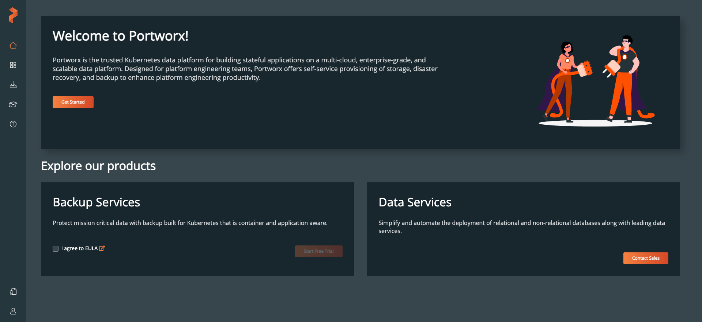
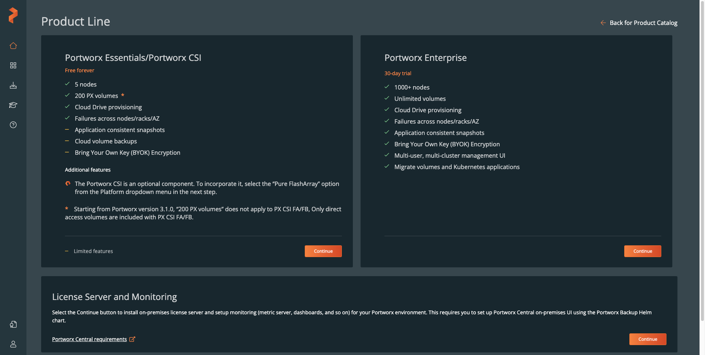
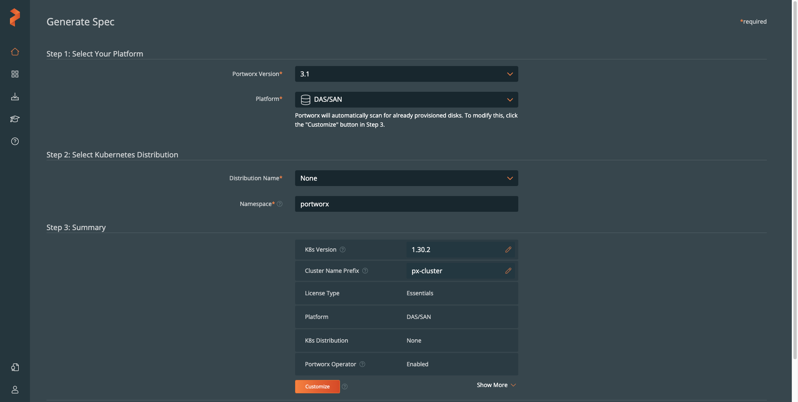
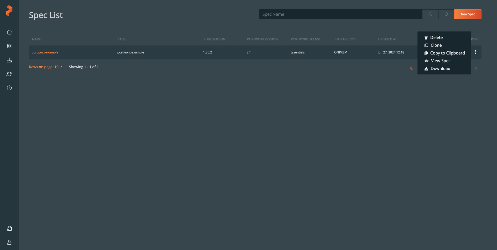

Management of data at scale is crucial for deriving actionable insights. An effective data platform can provide those kinds of insights. In today’s cloud environment, a diverse range of organizations and individuals rely on robust data platforms:

-   **Organizations** such as corporations, military, and charities must operate data platforms efficiently to convert their daily activities into strategic insights.

-   **Data engineers, scientists, and analysts** leverage the technical capabilities of data platforms for exploration, analysis, and visualization to maximize their technical capabilities.

-   **Developers** use data platform *Application Programming Interfaces* (APIs) and other services to create *Machine Learning* (ML) models, data gateways, and other specific applications.

-   **Administrators** keep data platforms healthy by ensuring they have the computing resources needed to meet their demands.

-   **IT staffers** ensure that data security, availability, governance, and compliance requirements are met when connecting a data platform to all the relevant individuals within an organization.

-   **Researchers** use data platforms to investigate complex questions involving large datasets.

This guide addresses the front-line computing specialists, administrators, developers, and data engineers who operate data platforms. It explores the practical tasks involved in making a data platform more useful with Portworx.

## What Is a Data Platform?

A data platform is the **technology infrastructure** used for the collection, storage, transaction processing, and analysis of varied data at scale. It simplifies engineering tasks such as expanding the storage available to an application or encrypting project secrets. Portworx addresses persistent storage, backup, data protection, disaster recovery, capacity management, and data migrations.

## What Is Portworx?

Launched in 2014, the Portworx data platform began operating as a subsidiary of Pure Storage in 2020. It now curates [a GitHub account](https://github.com/portworx) with 135 public repositories. A limited version of the Portworx Storage Platform is available for free. It allows for an implementation of object storage for a single distributed cluster. This guide focuses on the free, downloadable software that you can install and run for your own educational and small-scale uses.

## How Portworx Relates to Kubernetes, Kafka, and Cassandra

Portworx integrates with widely known software systems such as Kubernetes, Kafka, and Cassandra:

-   [**Kubernetes**](/docs/guides/kubernetes/) serves as the foundation of most Portworx implementations. However, Portworx is also compatible with other container orchestration systems.

-   [**Cassandra**](/docs/guides/databases/cassandra/) is an open source distributed database management system that emphasizes economical operation, high availability, and wide-column semantics. Portworx addresses several of the challenges involved in configuring and operating Cassandra. For example, when running Cassandra in containers managed by Kubernetes, Portworx can effectively control memory, resource quotas, and/or CPU cores per Kubernetes cluster.

-   [**Kafka**](/docs/guides/what-is-apache-kafka/) is a widely used open source distributed event store and stream-processing platform. In much the same way a traditional database system manages **records** of data, Kafka manages **events**. For Kafka to perform optimally, it needs a high-performance underlying storage system, and Portworx is a good choice. Teams and individuals often initially adopt Portworx to meet requirements for hosting or upgrading Kafka. In fact, Portworx offers white papers specifically on the [operation of Kafka in a Kubernetes environment](https://portworx.com/blog/deploying-kafka-on-kubernetes-using-portworx-data-services/).

### Remark on Nomenclature

Portworx defines itself as a "data service-as-a-service platform". Systems such as Kubernetes and Cassandra have clearly understood roles in most organizations. In contrast, Portworx and other competing data platforms are considerably less well known and understood. However, data platforms provide essential services that compliment and enhance these better-known systems.

### How to Be Cloud-Native

The term "cloud-native" is often incorrectly invoked by marketers. Use of the cloud is already widespread. After all, *billions* of users have email addresses they access as cloud services. In contrast to such introductory or superficial uses, "cloud native" actually refers to a radical or transformative use of cloud computing's full potential.

Portworx handles advanced storage and data management capabilities tailored for cloud-native environments. It enables deployment and management of storage and data services specifically in containerized environments. It also takes responsibility for data replication, snapshots, backups, and data recovery, which allows application systems to focus on their own specific requirements. Since Portworx itself is cloud-native, it plays a crucial role in helping other systems maximize the capabilities of the cloud.

Portworx ensures data durability and resiliency in the cloud. It facilitates trustworthy operation of stateful applications and enables data-intensive workloads in a cloud-native ecosystem. This helps cloud applications fulfill their operational promises.

Current cloud computing practices face several challenges, particularly the difficulty of managing Kubernetes instances in the real-world. Portworx mitigates some of these challenges. It bridges the gaps in real-world Kubernetes-based applications, allowing cloud computing to deliver even more on its promise.

## Before You Begin

1.  Create a Kubernetes cluster that meets the [Portworx installation prerequisites](https://docs.portworx.com/portworx-enterprise/install-portworx/prerequisites). A **Shared CPU**, **Linode 8 GB** plan is suitable. See our [Getting Stated with Kubernetes](/docs/products/compute/kubernetes/get-started/) guide for instructions.

1.  The Portworx installation prerequisites also include a backing drive (i.e. Volume) for each of three nodes, which must be at least 8 GB. Follow our [Getting Started with Block Storage](/docs/products/storage/block-storage/get-started/) guide to create and attach a 10 GB Volume to each node. Creating volumes via the **Storage** tab of the individual Kubernetes instances is more efficient than via **Volumes**, as it creates *and* attaches in one step.

1.  Sign up for a personal account on [Portworx Central](https://central.portworx.com).


This guide is written for a non-root user. Commands that require elevated privileges are prefixed with `sudo`. If you’re not familiar with the `sudo` command, see the [Users and Groups](/docs/guides/linux-users-and-groups/) guide.


## Portworx Installation

To install Portworx, use the basic installation model on an existing Kubernetes cluster. This can be any existing Kubernetes cluster, whether through Akamai Kubernetes or a manually constructed setup. You can also use [kind](https://kind.sigs.k8s.io/) for an installation purely within your desktop development environment.

Portworx is not an open source system, though it supports many [individual open source components](https://portworx.com/products/open-source/), and some of its [licenses](https://docs.portworx.com/portworx-enterprise/operations/licensing) involve no fee. However, installation is generally done through the Portworx website and not via standard command-line package managers such as `apt` or `brew`.

Follow the steps in the next four sections to install Portworx on an existing Kubernetes cluster.

### The Wizard

1.  Select **Get Started** from the **Welcome to Portworx** section of the Portworx Central home page:

    

1.  Choose the **Portworx Essentials/Portworx CSI** fee-free license for demonstration or proof-of-concept workloads:

    

1.  Choose `DAS/SAN` as **Platform** and `None` for **Distribution Name**. Retain `portworx` as the default **Namespace**, but change the **K8s Version** to match the Kubernetes version chosen during deployment (e.g. `1.30.2`).

    

    
    Use the following command to check your version of Kubernetes:

    ```command
    kubectl version
    ```
    

1.  Select **Save Spec** to generate `kubectl` commands for `Operator` and `StorageCluster`, which reflect the specifications chosen for the Portworx installation. Copy the `kubectl` commands for use in the next section.

    

1.  To save this configuration, fill in **Spec Name** and **Spec Tags** then click **Save Spec** again.

1.  Your generated spec manifest is now available in the **Spec List** section of Portworx Central. You can download it at any time by clicking the three vertical dots under **Actions** and choosing **Download**.

    

### Deployment

1.  Use the first `kubectl` command generated in the previous section to deploy the `Operator` specification. The command structure should follow that of the example command below:

    ```command
    kubectl apply -f 'https://install.portworx.com/?comp=pxoperator&kbver=&ns=portworx'
    ```

    ```output
    namespace/portworx created
    serviceaccount/portworx-operator created
    clusterrole.rbac.authorization.k8s.io/portworx-operator created
    clusterrolebinding.rbac.authorization.k8s.io/portworx-operator created
    deployment.apps/portworx-operator created
    ```

1.  Use the second `kubectl` command generated in the previous section to deploy the `StorageCluster` specification. The command structure should resemble the example command below:

    ```command
    kubectl apply -f 'https://install.portworx.com/?operator=true&mc=false&kbver=&ns=portworx&oem=esse&user=&b=true&iop=6&c=px-cluster-&stork=true&csi=true&mon=true&tel=true&st=k8s&promop=true'
    ```

    ```output
    storagecluster.core.libopenstorage.org/px-cluster- created
    secret/px-essential created
    ```

    
    If you receive any errors, use the exact commands shown on the **Generate Spec** screen. It is likely more current than the examples shown in this guide or even Portworx' own documentation.
    

### Verification

1.  Monitor Portworx nodes with the following command:

    ```command
    kubectl -n portworx get storagenodes -l name=portworx
    ```

    Eventually, each Portworx node appears as `Online` after the deployments finish:

    ```output
    NAME                            ID                                     STATUS   VERSION           AGE
    lke194968-280433-369bf4810000   f2522d07-0b59-482a-a8ae-bd2854fd7bc4   Online   3.1.2.0-fb52ced   4m46s
    lke194968-280433-438a8b610000   b1920afd-5326-48dc-9572-af8e638fd92b   Online   3.1.2.0-fb52ced   4m45s
    lke194968-280433-527b95040000   58649b41-b4c9-4c56-b983-e27a61c9f582   Online   3.1.2.0-fb52ced   4m46s
    ```

1.  Use the following command to monitor the status of an individual node:

    ```command
    kubectl -n portworx describe storagenode 
    ```

At this point, your working Kubernetes cluster includes a small Portworx deployment with a permanent fee-free license. You can use your cluster for educational practice, proofs-of-concept, or other demonstrations of Portworx' capabilities.

## Run a Model Portworx Project

The extensive [Portworx documentation](https://docs.portworx.com/) includes many examples of the benefits that Portworx brings to data application management. One example is [Run Kafka on Kubernetes at Scale with Portworx](https://blog.purestorage.com/purely-technical/run-kafka-kubernetes-scale-portworx/). While thousands of organizations already manually deploy Kafka to good effect, Portworx can enhance the process. Replacement of a manual deployment with Portworx' mediation automates disaster recovery, application-specific high availability, backup services, and capacity management.

Using the Portworx installation from the preceding section, follow the steps below to get started:

1.  Create a specification file named `sc-kafka-rf2.yaml`:

    ```command
    nano sc-kafka-rf2.yaml
    ```

    Give it the following contents:

    ```file {title="sc-kafka-rf2.yaml" lang="yaml"}
    kind: StorageClass
    apiVersion: storage.k8s.io/v1
    metadata:
      name: px-sc-kafka-repl2
    provisioner: kubernetes.io/portworx-volume
    allowVolumeExpansion: true
    parameters:
      repl: "2"
      priority_io: "high"
      io_profile: "db_remote"
      cow_ondemand: "true"
      disable_io_profile_protection: "1"
      nodiscard: "false"
      group: "kafka-broker-rep2"
      fg: "false"
    ```

    When done, press <kbd>CTRL</kbd>+<kbd>X</kbd>, followed by <kbd>Y</kbd> then <kbd>Enter</kbd> to save the file and exit `nano`.

    This storage specification provides several automations, including *replication*. The `repl: "2"` parameter maintains two full replicas of broker data (i.e. Kafka's content) across the failure domains of the hosting Kubernetes cluster. This ensures that Kafka continues without downtime even if one node fails.

1.  Use the following command to apply the `StorageClass`:

    ```command
    kubectl apply -f sc-kafka-rf2.yaml
    ```

    ```output
    storageclass.storage.k8s.io/px-sc-kafka-repl2 created
    ```

A complete working replication solution for Kafka is beyond the scope of this guide. However, Portworx provides a complete configuration, along with an installation script, in a [demonstration public repository](https://github.com/rsomu/kafka-setup-k8s).

Using Portworx for these services does more than just capture configuration in a well-documented and more maintainable format. According to Portworx, in the event of a failure, the configuration above "provides an 83% reduction in Kafka broker rebuild times". This improvement results from Portworx' agility in resource allocation. Storage-level replication makes it possible for Portworx to identify and re-assign healthy storage in the event of failure. This keeps data available while replicating almost immediately.

While Portworx usually requires several dozens of lines of configuration files, that's typically less than what administrators use to maintain a Kubernetes cluster. The savings from more efficient storage use can quickly exceed Portworx' license fees when terabytes of data are involved.

## Conclusion

Modern organizations manage vast amounts of data in the cloud, generally with Kubernetes as a base infrastructure. Portworx provides easier and more trustworthy management of the storage and other resource requirements of large-scale data systems running in cloud environments. While manual specification of Kubernetes-based applications remains common in commercial installations, Portworx can boost both the efficiency and the quality of deployments.